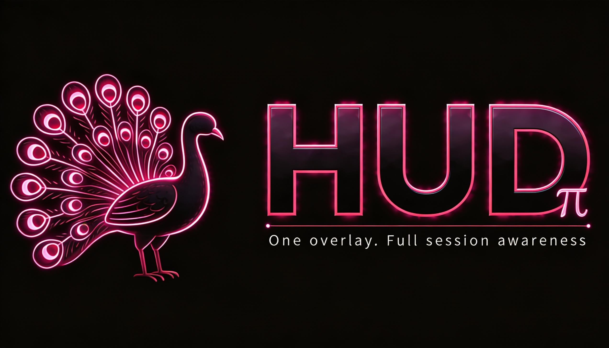
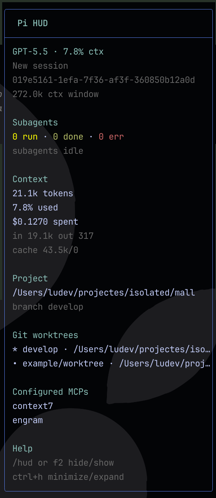

# pi-hud

[](https://www.npmjs.com/package/pi-hud)
[](https://pi.dev/packages/pi-hud?name=hud)
[](https://github.com/ludevdot/pi-hud/actions/workflows/ci.yml)
[](LICENSE)
[](https://github.com/ludevdot/pi-hud/stargazers)

Persistent right-side HUD for [Pi](https://pi.dev), published as a Pi package at [pi.dev/packages/pi-hud](https://pi.dev/packages/pi-hud?name=hud).

It shows the current session, model/context usage, subagent activity, project path, and git branch without stealing focus from the editor.



## Features

- Starts visible by default when the extension is installed.
- `/hud` toggle command.
- `/hud-settings` configuration command.
- Default hide/show keyboard shortcut: `f2`.
- Default minimize/expand keyboard shortcut: `ctrl+h`.
- Non-blocking TUI overlay: keep typing while the hud is visible.
- Live subagent status:
  - running/done/error counts;
  - active task label;
  - elapsed time;
  - token/context count when available.
- Session context usage and cost.
- Project path and current git branch.
- Registered git worktrees when the repository has more than one worktree.
- Configured MCP server names when `pi-mcp-adapter` is installed.

## Install

```bash
pi install npm:pi-hud
```

For project-local install:

```bash
pi install -l npm:pi-hud
```

## First 60 seconds

Use this quick path to confirm `pi-hud` is installed and responding:

1. Install it globally or for the current project:

   ```bash
   pi install npm:pi-hud
   # or: pi install -l npm:pi-hud
   ```

2. Start a new Pi session, or reload the current one:

   ```text
   /reload
   ```

3. Confirm the HUD appears on the right side. If it is hidden, toggle it:

   ```text
   /hud
   ```

4. Try one safe setting change:

   ```text
   /hud-settings position bottom-right
   ```

Global settings are stored in `~/.pi/agent/settings.json`; project-local settings live in `.pi/settings.json` and override global values.

## Try locally

From this repository:

```bash
pi -e .
```

From the Pi monorepo checkout during development:

```bash
./pi-test.sh --no-env -e /path/to/pi-hud
```

The HUD opens automatically on session start. Inside Pi, run:

```text
/hud
```

Run `/hud` again, or press `f2`, to hide or show it. Press `ctrl+h` to minimize or expand it.

## Commands

| Command         | Description                                              |
| --------------- | -------------------------------------------------------- |
| `/hud`          | Toggle the hud.                                          |
| `/hud-settings` | Configure position, shortcuts, auto-compact, and sizing. |

## Settings

`pi-hud` reads a `hud` object from Pi settings. Global settings live in `~/.pi/agent/settings.json`; project settings in `.pi/settings.json` override them.

Defaults:

```json
{
  "hud": {
    "position": "top-right",
    "shortcut": "f2",
    "minimizeShortcut": "ctrl+h",
    "autoCompactWhileStreaming": true,
    "expandedWidth": 42,
    "compactWidth": 26,
    "minTerminalWidth": 90,
    "margin": { "top": 1, "right": 1, "bottom": 1 }
  }
}
```

Supported `position` values are `center`, `top-left`, `top-right`, `bottom-left`, `bottom-right`, `top-center`, `bottom-center`, `left-center`, and `right-center`.

Examples:

```text
/hud-settings position bottom-right
/hud-settings shortcut ctrl+shift+h
/hud-settings minimizeShortcut ctrl+h
/hud-settings autoCompactWhileStreaming off
```

### Shortcut format

Write shortcuts as `modifier+key`, using lowercase names. Multiple modifiers can be combined with `+`.

| User-facing keys | Write in settings | macOS equivalent | Example |
| ---------------- | ----------------- | ---------------- | ------- |
| Control + key | `ctrl+key` | Control (`⌃`) + key | `ctrl+h` |
| Alt + key | `alt+key` | Option (`⌥`) + key | `alt+h` |
| Shift + key | `shift+key` | Shift (`⇧`) + key | `shift+f2` |
| Control + Shift + key | `ctrl+shift+key` | Control (`⌃`) + Shift (`⇧`) + key | `ctrl+shift+h` |
| Alt + Shift + key | `alt+shift+key` | Option (`⌥`) + Shift (`⇧`) + key | `alt+shift+h` |
| Function key | `f1`-`f12` | Function key, sometimes `fn` + key | `f2` |
| Command + key | Not recommended for terminal shortcuts | Command (`⌘`) + key | Prefer `ctrl+key` or `alt+key` |

For macOS users, write Option shortcuts as `alt+key`, not `option+key`. Command shortcuts are usually reserved by macOS or the terminal app, so they are not portable for HUD bindings.

> **macOS note:** Some terminals, including Warp depending on system settings, can route `f2` to macOS voice dictation instead of Pi. If `f2` opens dictation or does nothing in Pi, choose another shortcut such as `ctrl+shift+h` and run `/reload`.

### Recommended profiles

These profiles are copy-paste examples for your Pi settings file. They are documented examples, not built-in runtime presets. Each snippet is a partial override; unspecified HUD settings keep their default or previously configured values.

#### Minimal / low-noise HUD

Use this when screen space matters but you still want the HUD available.

```json
{
  "hud": {
    "expandedWidth": 32,
    "compactWidth": 20,
    "autoCompactWhileStreaming": true,
    "minTerminalWidth": 80
  }
}
```

#### Small terminal

Use this for narrow terminals. The HUD is still hidden when the terminal is narrower than `minTerminalWidth`.

```json
{
  "hud": {
    "expandedWidth": 30,
    "compactWidth": 18,
    "minTerminalWidth": 60,
    "margin": { "top": 0, "right": 0, "bottom": 0 }
  }
}
```

#### Bottom-right placement

Use this when top-right content conflicts with the HUD.

```json
{
  "hud": {
    "position": "bottom-right",
    "margin": { "right": 1, "bottom": 1 }
  }
}
```

#### No auto-compact

Use this if layout changes during assistant turns are distracting. Manual minimize/expand still works with `minimizeShortcut`.

```json
{
  "hud": {
    "autoCompactWhileStreaming": false
  }
}
```

#### Wider expanded panel

Use this on wide monitors to reduce truncation in the expanded HUD.

```json
{
  "hud": {
    "expandedWidth": 56,
    "compactWidth": 26,
    "minTerminalWidth": 110
  }
}
```

Shortcut changes require `/reload` because shortcuts are registered when the extension loads. Do not bind HUD shortcuts to `enter`, `return`, `alt+m`, `ctrl+m`, `ctrl+shift+m`, `ctrl+j`, or `ctrl+shift+j`; those conflict with Pi or terminal input keys.

## Notes

- Configured MCP servers are shown only when Pi has [`pi-mcp-adapter`](https://pi.dev/packages/pi-mcp-adapter?name=pi-mcp-adap) installed; config files alone do not enable the section.
- Subagent status is based on Pi extension events and `pi-subagents` tool/result shapes when available.
- The HUD auto-compacts for the full assistant turn and expands when the turn ends, instead of changing state on each reasoning update.
- The overlay is hidden on narrow terminals under the configured `minTerminalWidth`.

## Known limitations

### MCP connection status

The HUD shows configured MCP server names, not live connection status. It reads global and project MCP config paths and renders the configured names when `pi-mcp-adapter` is installed.

| Situation                                | What the HUD shows                 | Where to check live status                           |
| ---------------------------------------- | ---------------------------------- | ---------------------------------------------------- |
| `pi-mcp-adapter` is not installed        | No MCP section                     | Install the adapter before checking MCP state in Pi. |
| Adapter installed and MCP configs exist  | Configured server names            | Use `mcp({})` or `/mcp`.                             |
| Server configured but not connected      | The server name can still appear   | Use `mcp({})` or `/mcp`.                             |
| Connected, failed, cached, or auth state | Not currently available in the HUD | Use `mcp({})` or `/mcp`.                             |

For example, a project-local `.mcp.json` can make a server appear in the HUD even when that server is not currently connected. Use `mcp({})` or `/mcp` for live MCP status.

`pi-mcp-adapter` does not currently expose a public cross-extension status API for `pi-hud` to consume. If such an API becomes available, `pi-hud` can show live states such as connected, cached, failed, needs-auth, or not connected.

## Release notes

User-facing changes are tracked in [CHANGELOG.md](CHANGELOG.md). Maintainer release steps are documented in [RELEASING.md](RELEASING.md).

The package also ships a `pi-hud-release` skill so installed Pi agents can follow the project release workflow with the same checklist without colliding with generic release skills.

## Inspiration

`pi-hud` is inspired by [sub-agent-statusline](https://github.com/Joaquinvesapa/sub-agent-statusline).

---

## License

MIT
