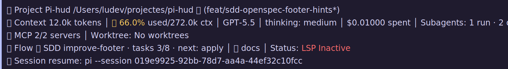

# pi-hud

[](https://www.npmjs.com/package/pi-hud)
[](https://pi.dev/packages/pi-hud?name=hud)
[](https://github.com/ludevdot/pi-hud/actions/workflows/ci.yml)
[](LICENSE)
[](https://github.com/ludevdot/pi-hud/stargazers)

Persistent HUD for [Pi](https://pi.dev), published as a Pi package at [pi.dev/packages/pi-hud](https://pi.dev/packages/pi-hud?name=hud).

It can run as the default right-side overlay or as an opt-in footer replacement. It shows the current session, model/context usage, subagent activity, project path, git branch, worktrees, and MCP configuration without stealing focus from the editor.




## Features

- Starts visible by default when the extension is installed.
- Shows a startup notice with the loaded HUD entry, toggle shortcut, and once-per-version packaged release notes.
- `/hud` toggle command.
- `/hud-mode` command to switch between overlay and footer mode.
- `/hud-settings` configuration command.
- Default hide/show keyboard shortcut: `ctrl+shift+h`.
- Default overlay/footer switch shortcut: `ctrl+.`.
- Default minimize/expand keyboard shortcut: `ctrl+h`.
- Non-blocking TUI overlay: keep typing while the hud is visible.
- Live subagent status:
  - running/done/error counts;
  - active task label;
  - elapsed time;
  - token/context count when available.
- Session context usage, cost, active model, and reasoning/thinking level when the selected model supports it.
- Project path, current git branch, and git status indicators.
- Registered git worktrees when the repository has more than one worktree.
- Configured MCP server names when `pi-mcp-adapter` is installed.
- Opt-in footer mode with compact multi-line status, full-line background styling, and emoji indicators for project, context, MCP, help, git status, and context pressure.

## Install

```bash
pi install npm:pi-hud
```

For project-local install:

```bash
pi install -l npm:pi-hud
```

## First 60 seconds

Use this quick path to confirm `pi-hud` is installed and responding:

1. Install it globally or for the current project:

   ```bash
   pi install npm:pi-hud
   # or: pi install -l npm:pi-hud
   ```

2. Start a new Pi session, or reload the current one:

   ```text
   /reload
   ```

3. Confirm the HUD appears on the right side. If it is hidden, toggle it:

   ```text
   /hud
   ```

4. Try footer mode, then switch back if you prefer the overlay:

   ```text
   /hud-mode footer
   /hud-mode overlay
   ```

5. Try one safe setting change:

   ```text
   /hud-settings position bottom-right
   ```

Global settings are stored in `~/.pi/agent/settings.json`; project-local settings live in `.pi/settings.json` and override global values.

## Try locally

From this repository, isolate the development extension from any globally installed `pi-hud` package:

```bash
pi --no-extensions -e .
```

To load only the HUD extension file while iterating:

```bash
pi --no-extensions -e ./extensions/hud.ts
```

From the Pi monorepo checkout during development:

```bash
./pi-test.sh --no-env -e /path/to/pi-hud
```

The HUD opens automatically on session start. Inside Pi, run:

```text
/hud
```

Run `/hud` again, or press `ctrl+shift+h`, to hide or show the overlay. Press `ctrl+.` to switch between overlay and footer mode. Press `ctrl+h` to minimize or expand the overlay. To replace Pi's built-in footer with the HUD footer, run `/hud-mode footer`.

## Commands

| Command | Description |
| --- | --- |
| `/hud` | Toggle the overlay HUD. |
| `/hud-mode` | Toggle between `overlay` and `footer`, or set one explicitly with `/hud-mode footer` and `/hud-mode overlay`. |
| `/hud-settings` | Open the HUD Settings modal for mode, position, shortcuts, startup notification, auto-compact, sizing, Modules visibility, current settings, and defaults. |

## Settings

`pi-hud` reads a `hud` object from Pi settings. Global settings live in `~/.pi/agent/settings.json`; project settings in `.pi/settings.json` override them.

Defaults:

```json
{
  "hud": {
    "mode": "overlay",
    "position": "top-right",
    "shortcut": "ctrl+shift+h",
    "switchShortcut": "ctrl+.",
    "minimizeShortcut": "ctrl+h",
    "autoCompactWhileStreaming": true,
    "startupNotification": true,
    "expandedWidth": 42,
    "compactWidth": 26,
    "minTerminalWidth": 90,
    "margin": { "top": 1, "right": 1, "bottom": 1 },
    "visibility": {
      "context": true,
      "project": true,
      "worktrees": true,
      "mcps": true
    }
  }
}
```

Supported `position` values are `center`, `top-left`, `top-right`, `bottom-left`, `bottom-right`, `top-center`, `bottom-center`, `left-center`, and `right-center`.

`mode` controls where Pi HUD renders. `overlay` is the default right-side HUD. `footer` replaces Pi's built-in footer with Pi HUD's compact multi-line footer. You can persist it in settings, switch immediately with `/hud-mode footer` and `/hud-mode overlay`, or press the configured `switchShortcut`.

Run `/hud-settings` with no arguments to open the centered HUD Settings modal. The modal shows current values, lets you edit settings, shows the current serialized configuration, and can restore defaults. Argument-based commands such as `/hud-settings mode footer` and `/hud-settings visibility context off` remain available for direct updates.

`startupNotification` controls the UI-only startup notification shown when `pi-hud` loads in an interactive session. It defaults to `true`, skips `/reload`, and can be disabled when you want a quieter startup. The notice is rendered with Pi's notification UI instead of a session message, so it does not add HUD text to the agent prompt context. When packaged release metadata is available, the startup notice includes the latest release commits once per version and records that marker in Pi's user state directory. The footer mode discovery tip is also shown once per packaged version and stored in the same state file.

`visibility` controls optional HUD modules from the `/hud-settings` → `Modules visibility` toggle list. All visibility items default to `true`; set an item to `false` to hide it in expanded HUD and any compact equivalent. The toggle list includes `Default settings` to restore every configurable module to visible. Supported keys are `context`, `project` (project path + branches), `worktrees`, and `mcps`. `Subagents` is intentionally not toggleable and remains visible when applicable. After changing module visibility, run `/reload` for the change to take effect.

Examples:

```text
/hud-mode footer
/hud-mode overlay
/hud-settings mode footer
/hud-settings position bottom-right
/hud-settings shortcut ctrl+shift+h
/hud-settings switchShortcut ctrl+.
/hud-settings minimizeShortcut ctrl+h
/hud-settings autoCompactWhileStreaming off
/hud-settings startupNotification off
/hud-settings visibility worktrees off
/hud-settings visibility context on
```

### Footer mode

Footer mode is opt-in because it replaces Pi's built-in footer. Use it when you want a fixed, compact status surface instead of the floating overlay. It avoids visually covering session text and makes terminal selection cleaner, so you can copy visible content without accidentally copying Pi HUD's overlay text.

```text
/hud-mode footer   # switch immediately and persist footer mode
/hud-mode overlay  # restore Pi's built-in footer and persist overlay mode
/hud-mode          # toggle between the two modes
```

The footer renders five compact lines:

```text
▏ 📁 Project  Pi-hud /Users/ludev/projectes/pi-hud 🟢 (main)
▏ 🧠 Context  12.0k tokens │ 🟢 6.0% used/200.0k ctx │ Claude Sonnet │ thinking: medium │ $0.01000 spent
▏ 🔌 MCP      2/4 servers │ Worktree: No worktrees
▏ ❔ Help     /hud-mode │ /hud-settings │ 🔗 docs │ Status: LSP Inactive
▏ 🔁 Session  resume: pi --session 019e9925-92bb-78d7-aa4a-44ef32c10fcc
```

When the project has exactly one active OpenSpec change, the help line becomes a short workflow hint instead of listing full SDD details:

```text
▏ 🧭 Flow     📐 SDD improve-footer · tasks 3/8 · next: apply │ 🔗 docs
```

The SDD hint appears only when `openspec/config.yaml` and a single `openspec/changes/<change-id>` directory are present. It stays one line, shortens before truncation in narrow terminals, and omits itself rather than guessing when multiple active changes exist.

Git status indicators:

| Indicator | Meaning | Branch suffix |
| --- | --- | --- |
| `🟢` | Clean working tree | none |
| `🟡` | Uncommitted changes | `*` |
| `🔴` | Merge/conflict state | `!` |

The context line includes the current model. If the selected model supports reasoning, it also shows the active Pi thinking level such as `thinking: medium`; non-reasoning models omit that segment.

Context pressure uses the same thresholds as the overlay HUD:

| Context used | Footer indicator |
| --- | --- |
| `<50%` | `🟢` accent |
| `50–84%` | `🟡` warning |
| `85–94%` | `🟡` bold warning |
| `>=95%` | `🔴` bold error |

Worktrees show `No worktrees` when Git only reports the current checkout. When linked worktrees exist, the footer shows the current worktree path. Footer mode also preserves non-duplicated extension statuses, such as LSP, but hides MCP status from the final line because Pi HUD already renders MCP in its own line. When Pi exposes live MCP status, the MCP count can start at `0/N servers` and increase as servers connect or are used. The final session line shows the exact `pi --session <id>` command to resume the current session later.

### Shortcut format

Write shortcuts as `modifier+key`, using lowercase names. Multiple modifiers can be combined with `+`.

| User-facing keys | Write in settings | macOS equivalent | Example |
| ---------------- | ----------------- | ---------------- | ------- |
| Control + key | `ctrl+key` | Control (`⌃`) + key | `ctrl+h` |
| Alt + key | `alt+key` | Option (`⌥`) + key | `alt+h` |
| Shift + key | `shift+key` | Shift (`⇧`) + key | `shift+f2` |
| Control + Shift + key | `ctrl+shift+key` | Control (`⌃`) + Shift (`⇧`) + key | `ctrl+shift+h` |
| Alt + Shift + key | `alt+shift+key` | Option (`⌥`) + Shift (`⇧`) + key | `alt+shift+h` |
| Function key | `f1`-`f12` | Function key, sometimes `fn` + key | `f2` |
| Command + key | Not recommended for terminal shortcuts | Command (`⌘`) + key | Prefer `ctrl+key` or `alt+key` |

For macOS users, write Option shortcuts as `alt+key`, not `option+key`. Command shortcuts are usually reserved by macOS or the terminal app, so they are not portable for HUD bindings.

> **macOS note:** Function keys such as `f2` can be intercepted by macOS, terminal emulators, keyboard settings, or multiplexers before Pi receives them. The default `ctrl+shift+h` avoids function keys and is usually more portable. The default switch shortcut is `ctrl+.` because it is short and avoids Pi's built-in bindings. `ctrl+s` is reserved by Pi for model saving and may also be captured by terminals with software flow control enabled, so Pi HUD rejects it. If your terminal does not emit `ctrl+.` or collapses `ctrl+shift+h` into `ctrl+h`, use another shortcut such as `ctrl+alt+s` or `ctrl+alt+h` and run `/reload`.

### Recommended profiles

These profiles are copy-paste examples for your Pi settings file. They are documented examples, not built-in runtime presets. Each snippet is a partial override; unspecified HUD settings keep their default or previously configured values.

#### Minimal / low-noise HUD

Use this when screen space matters but you still want the HUD available.

```json
{
  "hud": {
    "expandedWidth": 32,
    "compactWidth": 20,
    "autoCompactWhileStreaming": true,
    "minTerminalWidth": 80
  }
}
```

#### Small terminal

Use this for narrow terminals. The HUD is still hidden when the terminal is narrower than `minTerminalWidth`.

```json
{
  "hud": {
    "expandedWidth": 30,
    "compactWidth": 18,
    "minTerminalWidth": 60,
    "margin": { "top": 0, "right": 0, "bottom": 0 }
  }
}
```

#### Bottom-right placement

Use this when top-right content conflicts with the HUD.

```json
{
  "hud": {
    "position": "bottom-right",
    "margin": { "right": 1, "bottom": 1 }
  }
}
```

#### Footer mode

Use this when you want Pi HUD to live in the bottom footer instead of the overlay.

```json
{
  "hud": {
    "mode": "footer"
  }
}
```

#### No auto-compact

Use this if layout changes during assistant turns are distracting. Manual minimize/expand still works with `minimizeShortcut`.

```json
{
  "hud": {
    "autoCompactWhileStreaming": false
  }
}
```

#### Wider expanded panel

Use this on wide monitors to reduce truncation in the expanded HUD.

```json
{
  "hud": {
    "expandedWidth": 56,
    "compactWidth": 26,
    "minTerminalWidth": 110
  }
}
```

Shortcut changes require `/reload` because shortcuts are registered when the extension loads. Do not bind HUD shortcuts to `enter`, `return`, `alt+m`, `ctrl+m`, `ctrl+shift+m`, `ctrl+j`, `ctrl+shift+j`, or `ctrl+s`; those conflict with Pi or terminal input keys.

## Notes

- Configured MCP servers are shown only when Pi has [`pi-mcp-adapter`](https://pi.dev/packages/pi-mcp-adapter?name=pi-mcp-adap) installed; config files alone do not enable the section.
- Footer mode prefers Pi's live `MCP:` extension status when available, so the dedicated MCP line shows connected/total counts such as `0/4 servers` or `2/4 servers`.
- When no live `MCP:` extension status is available, footer mode falls back to the configured MCP server count in `N/N servers` form using the known adapter config sources.
- Subagent status is based on Pi extension events and `pi-subagents` tool/result shapes when available.
- The overlay auto-compacts for the full assistant turn and expands when the turn ends, instead of changing state on each reasoning update.
- Model and thinking-level changes trigger a HUD re-render so footer and overlay context status stay current.
- The overlay is hidden on narrow terminals under the configured `minTerminalWidth`.

## Known limitations

### MCP connection status

The overlay HUD shows configured MCP server names, not live connection status. When `pi-mcp-adapter` is installed, it reads the known adapter config sources without importing or depending on the adapter package: `~/.config/mcp/mcp.json`, `~/.pi/agent/mcp.json` (or `$PI_CODING_AGENT_DIR/mcp.json`), project `.mcp.json`, and project `.pi/mcp.json`.

Footer mode can also receive Pi's live `MCP:` footer extension status. When that status is present, footer mode shows the live connected/total value on the dedicated MCP line, suppresses the configured fallback count, and filters MCP out of the Help/Flow `Status:` segment.

| Situation                                      | What the HUD shows                                | Where to check live status                           |
| ---------------------------------------------- | ------------------------------------------------- | ---------------------------------------------------- |
| `pi-mcp-adapter` is not installed              | No configured MCP section                         | Install the adapter before checking MCP state in Pi. |
| Known adapter config sources exist             | Merged configured server names                    | Use `mcp({})` or `/mcp`.                             |
| Multiple sources define the same server         | Server name is shown once                         | Use `mcp({})` or `/mcp` for effective details.       |
| Footer live `MCP:` status exists               | Dedicated MCP line shows live count, e.g. `1/5 servers` | Use `mcp({})` or `/mcp` for details.            |
| Server configured but not connected            | The server name can still appear outside live footer status | Use `mcp({})` or `/mcp`.                  |
| Connected, failed, cached, or auth state       | Detailed per-server states are not shown directly | Use `mcp({})` or `/mcp`.                             |

`pi-mcp-adapter` does not currently expose a public cross-extension status API for `pi-hud` to consume. Footer mode can only show live MCP counts when Pi provides them through footer extension statuses.

## Release notes

User-facing changes are tracked in [CHANGELOG.md](CHANGELOG.md). Maintainer release steps are documented in [RELEASING.md](RELEASING.md).

The package also ships a `pi-hud-release` skill so installed Pi agents can follow the project release workflow with the same checklist without colliding with generic release skills.

## Inspiration

`pi-hud` is inspired by [sub-agent-statusline](https://github.com/Joaquinvesapa/sub-agent-statusline).

---

## License

MIT
